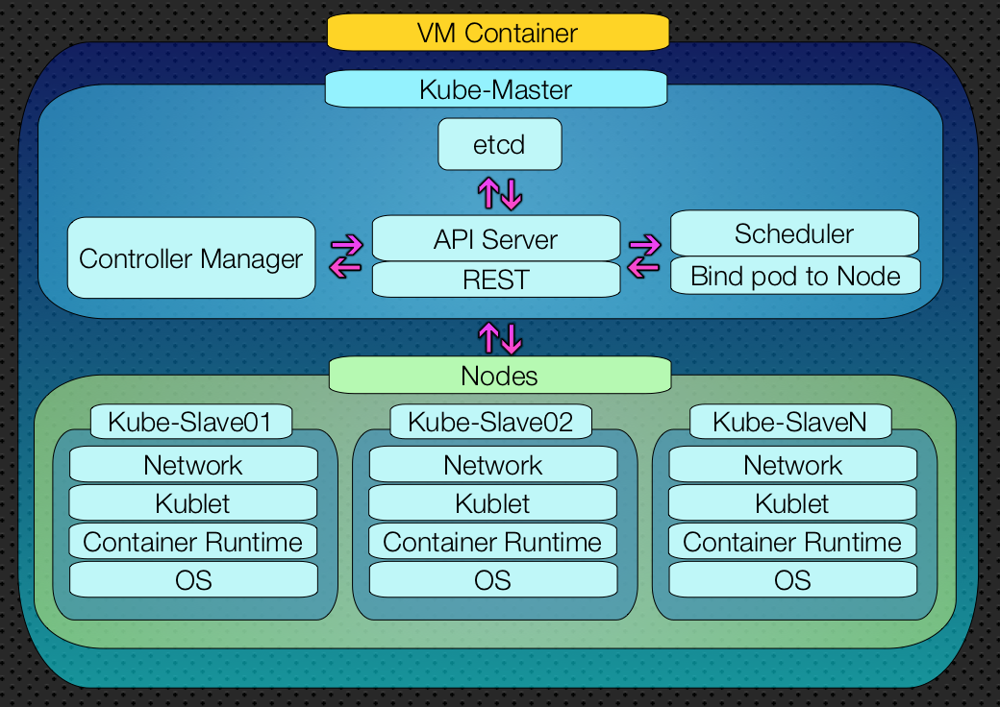

<div style="text-align:center">

</div>


# Costruisci il tuo Cluster Kubernetes Casalingo
#### Con versioni di Ubuntu dalla 18.04 alla 20.04

<div style="text-align:center">

</div>


Kubernetes è una piattaforma open source, sviluppata attivamente dalla comunità in tutto il mondo. Permette la gestione e l'orchestrazione di container di applicazioni su larga scala, garantisce alle compagnie risparmio di risorse e la possibilità di effettuare rilasci in sicurezza ed affidabilità, in ogni genere di situazione.
Kubernetes permette a tutti gli sviluppatori DevOps di avere uno strumento efficace per sviluppare e deployare applicazioni in autonomia.

Perché servono abilità da DevOps?

Oggigiorno i DevOps sono molto richiesti dall'industria del IT. Varie aziende richiedono profili in grado di sviluppare e rilasciare in produzione gli applicativi.
Il salario medio di un DevOps engineer in Silicon Valley è circa  $140,000 all'anno, ovvero il 20% superiore del salario di uno sviluppatore, solo in Italia si fa la fame ... e si continuando a sviluppare ancora applicazioni fortemente stateful e monolitiche.

Comunque possedere abilità DevOps oggi vuol dire essere molto competitivi sul mercato!

Per ulteriori informazioni vi prego di visitare il [sito ufficale](https://kubernetes.io/it/docs/concepts/overview/what-is-kubernetes/).


## Prerequisiti
- SO Linux / Windows / Mac
- [VMware](https://www.vmware.com/it.html) / [Oracle VM VirtualBox](https://www.virtualbox.org/) oppure un altro VM Container di vostro gradimento.
- - Installerò le VM su un server personale [PROXMOX](https://www.proxmox.com/en/)
- CPU Intel i5/i7/i9 oppure AMD Razen5/7
- RAM DISPONIBILE 12GB (Attenzione che non si potrà uttilizzare lo SWAP)
- HDD 150GB DISPONIBILI (Si consigia un SSD)
- [Download](https://releases.ubuntu.com/20.04.2/ubuntu-20.04.2-live-server-amd64.iso) di Ubuntu Server 20.04.2
- Salvare nei preferiti [kubernetes/docs](https://kubernetes.io/docs/reference/generated/kubectl/kubectl-commands#-strong-getting-started-strong)


## Server Personale
|  |  |
|:--------------|:-------------:|
| CPU   | i7 6°Gen 8 Core       |
| RAM   | 48Gb DDR4             |
| DISCO | SSD 512Gb + HDD 1Tb   |


<div>

</div>

#### Installare TRE VM:
-   VM Ubuntu Server (Configurazione minima per garatire un buon funzionamento)

| NOME | CPU | Ram (Mb)|  CPU Conf Consigliata | Ram (Mb) Conf Consigliata | Disco (GB)|
|:--------------|:-------------:|--------------:|--------------:|--------------:|--------------:|
| Kube-Master  | 2 | 4096 | 4 | 8192 | 50 |
| Kube-Slave01 | 1 | 2048 | 2 | 4096 | 50 |
| Kube-Slave02 | 1 | 2048 | 2 | 4096 | 50 |


## Installazione Ubuntu Server

[Per comodita usero PROXMOX seguire la guida](https://github.com/XtremeAlex/Kubernetes/tree/develop/proxmox) `/proxmox/README.md`


## Architettura Kubernates Finale
<div style="text-align:center">

</div>

## Queste modifiche devono essere applicate a ogni server.


#### Salire come root user
```
sudo -i
```

<details> <summary>Aggiornare/Installare i componenti neccessari</summary>

	apt-get update && apt-get install -y
	apt-get -y install vim git curl apt-transport-https wget gnupg ntpdate mlocate

</details>


## `Docker`

<details> <summary>Installare Docker</summary>

```
apt-get install docker.io
```

</details>

<details> <summary>Abilitare il servizio Docker durante l'avvio</summary>

```
systemctl enable docker.service
systemctl daemon-reload
systemctl restart docker
```

</details>

<details> <summary>Modificare/Creareun file di configurazione del servizio Docker</summary>

##### `ATTENZIONE`

Kubernetes non risulta compatibile con i file system formattati in ext4 ( consigliano lo zfs).
Durante lo start del master quindi se avete un file system formattato in ext4 potrebbe darvi un warning.
Potete comunque ingorarlo, infatti non vi impedirà di creare pod o deploy sul cluster che stiamo andando a creare. Bisogna però forzare l’uso dei driver “systemd”, aggiungere la configurazione come segue:

##### Soluzione Consigliata

- Questa soluzione non implica la modifica di unità systemd o drop-in.
- Creare (o modificare) il file di configurazione `vim /etc/docker/daemon.json` e includere quanto segue:

	```
	{
		"exec-opts": ["native.cgroupdriver=systemd"],
		"log-driver": "json-file",
		"log-opts": {
			"max-size": "100m"
			},
		"storage-driver": "overlay2"
	}
	```

##### Soluzione Alternativa:
- Questa soluzione implica la modifica di systemd.

	```
	updatedb
	```

	```
	locate docker.service
	```

	```
	vi /etc/systemd/system/multi-user.target.wants/docker.service
	```

	Aggiungere la seguente configurazione alla fine dell'elemento denominato: `ExecStart`
	In questo modo forzeremo l’uso dei driver `systemd`.

	```
	--exec-opt native.cgroupdriver=systemd
	```

	- File finale dopo la configurazione

	```
	code ...//

	Requires=docker.socket
	[Service]
	Type=notify
	ExecStart=/usr/bin/dockerd -H fd:// --containerd=/run/containerd/containerd.sock --exec-opt native.cgroupdriver=systemd
	ExecReload=/bin/kill -s HUP $MAINPID
	TimeoutSec=0

	//... code
	```

Riavvia il servizio Docker e verificare lo stato.

```
systemctl restart docker
systemctl status docker
```

</details>

## `SYSTEMA`

<details> <summary>Disabilitare lo SWAP</summary>

##### `ATTENZIONE`

Affinché `kubelet` funzioni correttamente, è essenziale disabilitare la `memoria SWAP`, cioè lo spazio di paginazione del disco rigido che viene utilizzato per memorizzare temporaneamente i dati quando non c'è abbastanza spazio nella RAM.

- Disabilitare l'utilizzo della memoria Swap, usando uno dei comandi a scelta:
	```
	sudo sed -i '/ swap / s/^\(.*\)$/#\1/g' /etc/fstab
	```

	- Oppure
	```
	sudo sed -i '/ swap / s/^/#/' /etc/fstab
	```

	- Oppure
	```
	swapoff -a
	```
- Lanciare dalla bash in cmd `free` per verificare lo swap.
- Alcuni preferiscono creare una `crontab` per disattivare ad ogni riavvio lo swap

	```
	sudo -s
	crontab -e
	```

	aggiungere:
	```
	@reboot sudo swapoff -a  
	```

</details>

<details> <summary>Editare i file di host</summary>

##### Modificare i file di host `vim /etc/hosts`

I vostri IP potrebbero essere diversi, dipende da come sono stati staccati dal DHCP.

- Sul server `Kube-Master`

```
127.0.0.1 localhost
xxx.xxx.xxx.110 externalip

127.0.0.1       kube-master
xxx.xxx.xxx.111 kube-slave01
xxx.xxx.xxx.112 kube-slave02
```

- Sul server `Kube-Slave01`

```
127.0.0.1 localhost
xxx.xxx.xxx.111 externalip

xxx.xxx.xxx.110 kube-master
127.0.0.1       kube-slave01
xxx.xxx.xxx.112 kube-slave02
```

- Sul server `Kube-Slave02`

```
127.0.0.1 localhost
xxx.xxx.xxx.112 externalip

xxx.xxx.xxx.110 kube-master
xxx.xxx.xxx.111 kube-slave01
127.0.0.1       kube-slave02
```

</details>

## `Kubernastes`
<details> <summary>Creare un file per configurare le variabili di ambiente necessarie</summary>

- Creare un sh `kubernetes.sh` in `/etc/profile.d` lanciando il cmd `vim /etc/profile.d/kubernetes.sh`
```
#!/bin/bash
export KUBECONFIG=/etc/kubernetes/admin.conf
```

- Riavviare la VM.
```
reboot
```

- Salire come root user
```
sudo -i
```

</details>

<details> <summary>Scaricare e installare la chiave del repository Kubernetes.</summary>

```
curl -s https://packages.cloud.google.com/apt/doc/apt-key.gpg | apt-key add
```

</details>


<details> <summary>Aggiungi il repository ufficiale Kubernetes.</summary>

```
apt-add-repository "deb http://apt.kubernetes.io/ kubernetes-xenial main"
```

- Oppure puoi lanciare il seguente cmd:
```
echo "deb https://apt.kubernetes.io/ kubernetes-xenial main" | tee /etc/apt/sources.list.d/kubernetes.list"
```

</details>


<details> <summary>Install Kubelet, Kubeadm, and Kubectl.</summary>

- `Kubelet`: questo è un servizio di sistema che viene eseguito su tutti i nodi e configura i vari componenti del cluster.
- `Kubeadm`: questo strumento permette da riga di comando di installare e configurare i vari componenti del cluster.
- `Kubectl`: questo strumento permette da riga di comando di inviare comandi al cluster tramite l'API. Rende più facile lavorare con i comandi nel terminale.
	```
	apt update
	apt -y install kubeadm kubectl kubelet
	```

</details>

<details> <summary>Impostiamo il kubelet in modalità standby </summary>

##### `ATTENZIONE`
kubelet si riavvia ogni secondo poiché è in attesa di ulteriori azioni, perciò lanciare il seguente cmd per metterlo in standby.

```
apt-mark hold kubelet kubeadm kubectl
```

</details>


<details> <summary>Configurare l'utenza Kubernates</summary>

##### `ATTENZIONE`
Ora la scelta migliore ricade sul creare un Utente non Privilegiato.
- Creiamo un utente linux, noi lo chiameremo `kube`e successivamente logghiamo con quell’utente
```
sudo -i
useradd kube -G sudo -m -s /bin/bash
passwd kube
su kube
```

- Ora possiamo configurare le variabili d’ambiente sul nuovo utente
```
cd $HOME
sudo cp /etc/kubernetes/admin.conf $HOME/
sudo chown $(id -u):$(id -g) $HOME/admin.conf
export KUBECONFIG=$HOME/admin.conf
echo “export KUBECONFIG=$HOME/admin.conf” | tee -a ~/.bashrc
```

</details>


<details> <summary>Verifichiamo l'installazione di kubectl</summary>

```
kubectl version --client && kubeadm version
```

</details>


## `Firewall`
<details> <summary>Configurare il Firewall</summary>


##### `ATTENZIONE`
`br_netfilter` è un modulo del kernel ed è necessario abilitarlo per attivare il traffico con bridge tra i pod Kubernetes nel cluster.

Consente ai membri del cluster di essere visualizzati come se fossero direttamente collegati tramite cavo.

- Per iniziare, dobbiamo assicurarci che il modulo br_netfilter venga caricato, utilizzando il seguente comando:
```
lsmod | grep br_netfilter
```

- In alternativa si può caricare `br_netfilter` usando i seguenti cmd.
```
modprobe overlay
modprobe br_netfilter
```

- Un' altra opzione è quella di modificare il file di configurazione denominato `MODULES.CONF` e aggiungere quanto segue:
```
vim /etc/modules-load.d/modules.conf
overlay
br_netfilter
```

</details>

<details> <summary>Configurare il Sistema</summary>


##### `ATTENZIONE`
I moduli del kernel sono file di codice che possono essere caricati e rimossi dal kernel su richiesta.
Essi estendono le funzionalità del kernel senza bisogno di riavviare il sistema.
I moduli extra al kernel da caricare durante il boot sono configurati in una lista statica in `etc/modules-load.d/`

Configuriamo iptables per consentire il traffico attraverso il bridge di rete.
Questa modifica è vitale perché iptables (il firewall predefinito del server) dovrebbe sempre esaminare il traffico che passa sulle connessioni.

Creare un file di configurazione di sistema, nella configurazione sysctl da K8s, assegniamo il valore 1, che significa controllare il traffico.


```
vi /etc/sysctl.d/k8s.conf

net.bridge.bridge-nf-call-ip6tables = 1
net.bridge.bridge-nf-call-iptables = 1
net.ipv4.ip_forward = 1

```

</details>

<details> <summary>Abilitare il file di configurazione del sistema.</summary>

```
sysctl --system
```

</details>


## `Kublet`
<details> <summary>Avvio kubelet</summary>

```
systemctl enable kubelet
```

</details>


## `Kubeadm`

<details> <summary>Scarica le config necessarie.</summary>

```
kubeadm config images pull
```
</details>


<details> <summary>Starta il Master</summary>

##### `ATTENZIONE`

`--pod-network-cidr`: Viene utilizzato per configurare la rete e impostare gli intervalli CIDR (Classless Inter-Domain Routing), che è un metodo di indirizzamento IP senza classi.

`--control-plane-endpoint`: Questo è un set di endpoint di controllo comune per tutti i nodi se si utilizza in un cluster ad alta disponibilità.

`Copiare l'output di questo comando che ci servirà in seguito.`
Questo comando ci servirà sugli slave per fare il Join al master.
```
kubeadm init --pod-network-cidr=10.0.0.0/16 --control-plane-endpoint=kube-master
```

</details>

## `Kubectl`
<details> <summary>Applicazione del primo POD</summary>

- Il pod che andremo ad applicare servirà per mettere in comunicazione il master coi vari nodi.

	```
	kubectl apply -f https://raw.githubusercontent.com/coreos/flannel/master/Documentation/kube-flannel.yml
	kubectl apply -f https://raw.githubusercontent.com/coreos/flannel/master/Documentation/k8s-manifests/kube-flannel-rbac.yml
	```

- In caso non siano disponibli i url a kube-flannel ho rilasciato in questo repository i file necessari:

	```
	kubectl apply -f flannel/kube-flannel.yml
	kubectl apply -f flannel/kube-flannel-rbac.yml
	```

- Per verificare il corretto stato del Pod:

	```
	kubectl get pods –all-namespaces
	```
</details>

<details> <summary>Chi sono gli slave ?</summary>

### Sul nodo Master
Per impostazione predefinita, il tuo cluster non schedula i pod in modo automatico sul master per motivi di sicurezza.

Possiamo anche fare in modo che il master diventi slave di se stesso, infatti in base alla scelta dei seguenti cmd non potrebbe caricare i pod che andremo a installare, naturalmente questo passaggio è consigliato o meno in base al cluster che andrete a costruire.

#### Per abilitare/disattivare la schedulazione dei pod sul nodo master:

##### add taints `(non schedulare pods su master)`:
```
kubectl taint node kube-master node-role.kubernetes.io/master:NoSchedule
```

#####  remove taints `(consenti di schedule pods su master)`:
```
kubectl taint nodes --all node-role.kubernetes.io/master-
```

- ##### Se vuoi sapere se `ci sono o meno contaminazioni sul nodo master ?`, esegui il seguente comando:
	```
	kubectl get node kube-master --export -o yaml
	```

##### Oppure dopo aver aggiunto i nodi lanciare i seguenti cmd per ogni nodo

```
kubectl taint node kube-slave01 node-role.kubernetes.io/master:NoSchedule-
kubectl taint node kube-slave02 node-role.kubernetes.io/master:NoSchedule-
```

</details>

<details> <summary>Aggiungi altri Nodi</summary>

<div>

</div>

Ora possiamo fare la join di un numero qualsiasi di nodi al master copiando  con le chiavi dell'account master su ciascun nodo e quindi eseguendo il comando seguente come root su ogni slave/nodo.

 -  Da eseguire su ogni Slave disponibile:
```
kubeadm join kube-master:6443 --token bf6w4x.t6l461giuzqazuy2 \
--discovery-token-ca-cert-hash sha256:8d0b3...721
```

Se per qualche motivo avessimo perso questa stringa, nessun problema, basterà scrivere sul master, con l’utente `kube`
#### `ATTENZIONE`
Questo genererà un nuovo token per il join, non andando a impattare in nessun modo su chi già si trova nel cluster.

```
kubeadm token create –print-join-command
```
</details>

<details> <summary>Verifica i nodi del cluster</summary>


Ora sul server Master, esegui il seguente comando per verificare se gli Slave sono stati aggiunti al cluster.
```
kubectl get nodes
```

Possiamo In caso anche aggiungere altri server master:
```
kubeadm join kube-master:6443 --token bf6w4x.t6l461giuzqazuy2 \
--discovery-token-ca-cert-hash sha256:8d0b3...b7d064e \
--control-plane
```

</details>

<details> <summary>Verifichiamo lo stato del Cluster</summary>

```
kubectl cluster-info
```
</details>

<details> <summary>Installa Calico</summary>

#### Installa Calico Solamente sul Master
Ora bisogna installare il plugin [Calico](https://docs.projectcalico.org/about/about-calico).
Questo plug-in di rete viene usato sia su host fisici che sulle macchine virtuali, viene utilizzato per motivi di sicurezza.
```
kubectl apply -f https://docs.projectcalico.org/manifests/calico.yaml
```

</details>

<details> <summary>Verifichiamo lo stato dei Pod</summary>

```
kubectl get pods --all-namespaces -o jsonpath="{..image}" |\
tr -s '[[:space:]]' '\n' |\
sort |\
uniq -c
```
</details>

<details> <summary>Verifichiamo la configurazione</summary>

```
kubectl get nodes -o wide

https://MASTERIP:6443/
```

</details>

<details> <summary>Aggiungere/Modificare i ruoli ai nodi</summary>

#### Aggiungere i ruoli ai nodi
```
kubectl label node <node name> node-role.kubernetes.io/<role name>=<key - (any name)>
```

```
kubectl label nodes kube-slave01 kubernetes.io/role=worker1
kubectl label nodes kube-slave02 kubernetes.io/role=worker2
kubectl get nodes -o wide
```

##### Aggiorna i ruoli ai nodi in kubernetes
```
kubectl label --overwrite nodes <your_node> kubernetes.io/role=<your_new_label>
```

```
kubectl label --overwrite nodes kube-slave01 kubernetes.io/role=custom,worker1
kubectl get nodes -o wide
```


##### Rimuovi i ruoli ai nodi in kubernetes
```
kubectl label node <node name> node-role.kubernetes.io/<role name>-
```

```
kubectl label node kube-slave01 node-role.kubernetes.io/worker1-
kubectl label node kube-slave02 node-role.kubernetes.io/worker2-
kubectl get nodes -o wide
```

</details>


### Deployamo un'applicazione di Test

<details> <summary>Creazione di una folder di lavoro</summary>

Creare una folder che useremmo per creare le nostre configurazioni:
```
mkdir -p /kubernates/nginx
```

Dare il permesso a tutti gli utenti:
```
mkdir -p /kubernates/nginx
```
Oppure:

```
chmod -R 777 /kubernates/nginx
```

</details>

<details> <summary>Creazione YML deployment</summary>

Creare il file `deployment.yaml`
```
vim /kubernates/nginx/deployment.yaml
```

```
apiVersion: apps/v1
kind: Deployment
metadata:
  name: nginx-deployment
spec:
  selector:
    matchLabels:
      app: nginx
  replicas: 2 # tells deployment to run 2 pods matching the template
  template:
    metadata:
      labels:
        app: nginx
    spec:
      containers:
      - name: nginx
        image: nginx:1.14.2
        ports:
        - containerPort: 80
```

Installare il nuovo deployment su Kubernetes.

```
kubectl apply -f /kubernates/nginx/deployment.yaml
```

Verificare i deployment avviati
```
kubectl get deployment
```

</details>

<details> <summary>Creazione YML servizio</summary>

Creare un file YAML con la nuova configurazione del servizio. (IP => kube-master)
```
vim /kubernates/nginx/service.yaml
```

```
apiVersion: v1
kind: Service
metadata:
  name: nginx-service
  labels:
    app: nginx
spec:
  type: NodePort
  selector:
    app: nginx
  ports:
    - protocol: TCP
      targetPort: 80
      port: 80
  externalIPs:
    - xxx.xxx.xxx.110
```

Installare il nuovo servizio Kubernetes.

```
kubectl apply -f /kubernates/nginx/service.yaml
```

Verificare l'elenco dei servizi Kubernetes.

```
kubectl get services
```

</details>


<details> <summary>Verificare l'elenco dei pods Kubernetes.</summary>

```
kubectl get pods --output=wide
```

- E' stato creato un nuovo POD usando l'immagine NGINX.
- E' stato creato un nuovo servizio denominato nginx-deployment.
- E' stato esposto la porta 80 dal nostro POD come la porta 80 dell'host externalip.

Utilizzare il comando CURL per verificare la comunicazione con il POD che esegue Nginx.
```
curl http://externalip
```

Apri il tuo browser e inserisci l'indirizzo IP del tuo server Kubernetes.
Nel nostro esempio, il seguente URL è stato immesso nel browser:
• http://externalip

Il server Kubernetes visualizzerà la pagina Nginx.

</details>

<details> <summary>Eliminare il servizio Nginx</summary>

### Eliminare il test, cancellando il services e deployment
```
kubectl delete services nginx-service
kubectl delete deployment nginx-deployment
```

</details>

## Author
`Andrei Alexandru Dabija`

###### Un sincero grazie alla community mi ha permesso di fornirvi questa guida, in caso di ulteriori approfondimenti vi lascio gli url:
- [StackOverflow](https://stackoverflow.com/search?q=kubernates)
- [Techexpert](https://techexpert.tips/it/kubernetes-it/installazione-di-kubernetes-su-ubuntu-linux/)
- [liquidweb](https://www.liquidweb.com/kb/how-to-install-kubernetes-using-kubeadm-on-ubuntu-18/)
