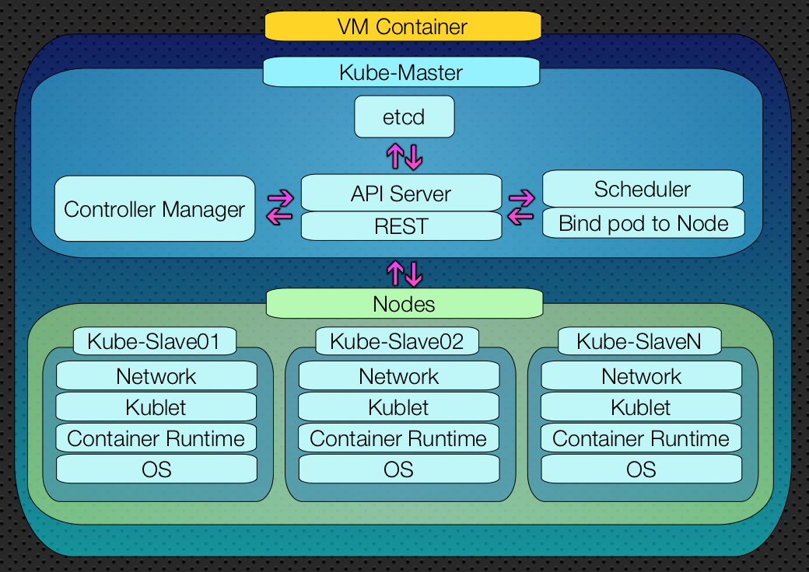

<div align="center">

</div>

# Costruisci il tuo cluster Kubernetes casalingo

#### Su Ubuntu, dalla 18.04 alla 20.04

<div align="center">

</div>

Kubernetes è una piattaforma open source, sviluppata da una comunità attiva in
tutto il mondo, che gestisce e orchestra container applicativi su larga scala.
Alle aziende fa risparmiare risorse e permette rilasci sicuri e affidabili in
ogni situazione; a chi fa DevOps dà uno strumento efficace per sviluppare e
rilasciare applicazioni in autonomia.

Perché vale la pena imparare il DevOps? Perché le aziende IT cercano persone
capaci di sviluppare e anche di portare in produzione le applicazioni. In
Silicon Valley un DevOps engineer guadagna in media circa 140.000 dollari
l'anno, il 20% in più di uno sviluppatore. In Italia siamo lontani da quei
numeri, e si sviluppano ancora molte applicazioni fortemente stateful e
monolitiche. Proprio per questo, saper fare DevOps oggi ti rende molto
competitivo sul mercato.

Per approfondire, parti dal [sito ufficiale](https://kubernetes.io/it/docs/concepts/overview/what-is-kubernetes/).

> **Guida datata (2021).** Il percorso resta valido per capire come si monta un
> cluster con kubeadm, ma alcuni passaggi oggi vanno aggiornati:
> - il repository `apt.kubernetes.io` / `packages.cloud.google.com` è stato
>   dismesso: i pacchetti ora sono su `pkgs.k8s.io` (vedi la
>   [documentazione ufficiale di kubeadm](https://kubernetes.io/docs/setup/production-environment/tools/kubeadm/install-kubeadm/));
> - da Kubernetes 1.24 Docker non è più supportato direttamente come runtime:
>   usa containerd (o Docker con `cri-dockerd`);
> - il taint `node-role.kubernetes.io/master` è diventato
>   `node-role.kubernetes.io/control-plane`;
> - la guida installa sia Flannel sia Calico: in pratica ne basta uno (sceglilo
>   e fai combaciare `--pod-network-cidr`).
>
> Per un cluster leggero e aggiornato vedi anche [K3s su Raspberry Pi](../k3s-raspberry/).

## Cosa ti serve

- Un computer con Linux, Windows o macOS
- [VMware](https://www.vmware.com/it.html), [Oracle VM VirtualBox](https://www.virtualbox.org/) o un altro hypervisor a tua scelta
  - io installo le VM sul mio server personale con [Proxmox](https://www.proxmox.com/en/)
- CPU Intel i5/i7/i9 oppure AMD Ryzen 5/7
- 12 GB di RAM liberi (attenzione: non si può usare lo swap)
- 150 GB di disco liberi (meglio un SSD)
- Ubuntu Server 20.04.2: [download](https://releases.ubuntu.com/20.04.2/ubuntu-20.04.2-live-server-amd64.iso)
- Nei preferiti: la [documentazione di kubectl](https://kubernetes.io/docs/reference/generated/kubectl/kubectl-commands#-strong-getting-started-strong)

## Il mio server

|  |  |
|:--|:-:|
| CPU   | i7 6ª gen, 8 core   |
| RAM   | 48 GB DDR4          |
| Disco | SSD 512 GB + HDD 1 TB |

<div>

</div>

#### Le tre VM

Tutte con Ubuntu Server. Il minimo basta per un buon funzionamento; se puoi,
usa la configurazione consigliata.

| Nome | CPU (minimo) | RAM MB (minimo) | CPU (consigliata) | RAM MB (consigliata) | Disco (GB) |
|:--|:-:|--:|--:|--:|--:|
| Kube-Master  | 2 | 4096 | 4 | 8192 | 50 |
| Kube-Slave01 | 1 | 2048 | 2 | 4096 | 50 |
| Kube-Slave02 | 1 | 2048 | 2 | 4096 | 50 |

## Installare Ubuntu Server

Per comodità uso Proxmox: segui la guida in [`/proxmox`](https://github.com/XtremeAlex/Kubernetes/tree/develop/proxmox)
per creare le VM, poi quella del repository Linux per
[installare Ubuntu Server](https://github.com/XtremeAlex/Linux/tree/main/ubuntu).

## Com'è fatto il cluster alla fine

<div align="center">

</div>

## Da fare su ogni server

Le sezioni che seguono, fino a "Kubelet" compresa, vanno eseguite su tutte e tre
le VM. Parti diventando root:

```
sudo -i
```

<details> <summary>Aggiornare e installare i pacchetti necessari</summary>

	apt-get update
	apt-get -y install vim git curl apt-transport-https wget gnupg ntpdate mlocate

</details>

## Docker

<details> <summary>Installare Docker</summary>

```
apt-get install docker.io
```

</details>

<details> <summary>Avviare Docker al boot</summary>

```
systemctl enable docker.service
systemctl daemon-reload
systemctl restart docker
```

</details>

<details> <summary>Configurare Docker per usare il driver cgroup systemd</summary>

##### Attenzione

Kubernetes non ama i file system ext4 (consiglia zfs): se il tuo è ext4, all'avvio
del master potresti vedere un warning. Puoi ignorarlo, non ti impedirà di creare
pod o deploy nel cluster. Devi però forzare l'uso del driver `systemd`, in uno
dei due modi seguenti.

##### Soluzione consigliata

Non richiede di modificare unit systemd o drop-in. Crea (o modifica)
`/etc/docker/daemon.json` con `vim /etc/docker/daemon.json` e inserisci:

	```
	{
		"exec-opts": ["native.cgroupdriver=systemd"],
		"log-driver": "json-file",
		"log-opts": {
			"max-size": "100m"
			},
		"storage-driver": "overlay2"
	}
	```

##### Soluzione alternativa

Questa invece modifica la unit systemd di Docker. Trova il file:

	```
	updatedb
	```

	```
	locate docker.service
	```

	```
	vi /etc/systemd/system/multi-user.target.wants/docker.service
	```

In fondo alla riga `ExecStart` aggiungi l'opzione che forza il driver `systemd`:

	```
	--exec-opt native.cgroupdriver=systemd
	```

Il file finale sarà più o meno così:

	```
	code ...//

	Requires=docker.socket
	[Service]
	Type=notify
	ExecStart=/usr/bin/dockerd -H fd:// --containerd=/run/containerd/containerd.sock --exec-opt native.cgroupdriver=systemd
	ExecReload=/bin/kill -s HUP $MAINPID
	TimeoutSec=0

	//... code
	```

In entrambi i casi riavvia Docker e controlla lo stato:

```
systemctl restart docker
systemctl status docker
```

</details>

## Sistema

<details> <summary>Disabilitare lo swap</summary>

##### Attenzione

Perché `kubelet` funzioni bene lo swap deve essere disattivato. Lo swap è lo
spazio su disco usato per parcheggiare temporaneamente i dati quando la RAM non
basta.

- Disattivalo con uno di questi comandi, a scelta:
	```
	sudo sed -i '/ swap / s/^\(.*\)$/#\1/g' /etc/fstab
	```

	- oppure
	```
	sudo sed -i '/ swap / s/^/#/' /etc/fstab
	```

	- oppure
	```
	swapoff -a
	```
- Controlla con `free` che lo swap sia a zero.
- C'è anche chi preferisce una `crontab` che disattivi lo swap a ogni riavvio:

	```
	sudo -s
	crontab -e
	```

	e aggiungi:
	```
	@reboot sudo swapoff -a  
	```

</details>

<details> <summary>Modificare il file hosts</summary>

##### Modifica `/etc/hosts` con `vim /etc/hosts`

I tuoi IP saranno probabilmente diversi: dipende da cosa ha assegnato il DHCP.

- Sul server `Kube-Master`

```
127.0.0.1 localhost
xxx.xxx.xxx.110 externalip

127.0.0.1       kube-master
xxx.xxx.xxx.111 kube-slave01
xxx.xxx.xxx.112 kube-slave02
```

- Sul server `Kube-Slave01`

```
127.0.0.1 localhost
xxx.xxx.xxx.111 externalip

xxx.xxx.xxx.110 kube-master
127.0.0.1       kube-slave01
xxx.xxx.xxx.112 kube-slave02
```

- Sul server `Kube-Slave02`

```
127.0.0.1 localhost
xxx.xxx.xxx.112 externalip

xxx.xxx.xxx.110 kube-master
xxx.xxx.xxx.111 kube-slave01
127.0.0.1       kube-slave02
```

</details>

## Kubernetes

<details> <summary>Impostare le variabili d'ambiente</summary>

- Crea lo script `kubernetes.sh` in `/etc/profile.d` con `vim /etc/profile.d/kubernetes.sh`:
```
#!/bin/bash
export KUBECONFIG=/etc/kubernetes/admin.conf
```

- Riavvia la VM:
```
reboot
```

- e torna root:
```
sudo -i
```

</details>

<details> <summary>Scaricare e installare la chiave del repository Kubernetes</summary>

```
curl -s https://packages.cloud.google.com/apt/doc/apt-key.gpg | apt-key add -
```

</details>

<details> <summary>Aggiungere il repository ufficiale Kubernetes</summary>

```
apt-add-repository "deb http://apt.kubernetes.io/ kubernetes-xenial main"
```

- In alternativa:
```
echo "deb https://apt.kubernetes.io/ kubernetes-xenial main" | tee /etc/apt/sources.list.d/kubernetes.list
```

Nota: questo repository oggi non è più attivo; vedi il riquadro in cima alla guida.

</details>

<details> <summary>Installare kubelet, kubeadm e kubectl</summary>

- `kubelet`: il servizio di sistema che gira su tutti i nodi e configura i vari componenti del cluster.
- `kubeadm`: lo strumento da riga di comando che installa e configura i componenti del cluster.
- `kubectl`: lo strumento da riga di comando che manda comandi al cluster tramite le API. È quello che userai di più nel terminale.
	```
	apt update
	apt -y install kubeadm kubectl kubelet
	```

</details>

<details> <summary>Bloccare le versioni di kubelet, kubeadm e kubectl</summary>

##### Attenzione

A questo punto kubelet si riavvia ogni secondo perché aspetta istruzioni: è
normale. Blocca le versioni dei pacchetti, così un aggiornamento automatico non
rompe il cluster:

```
apt-mark hold kubelet kubeadm kubectl
```

</details>

<details> <summary>Creare l'utente Kubernetes</summary>

##### Attenzione

Meglio lavorare con un utente non privilegiato. Creiamo un utente Linux, lo
chiamiamo `kube`, e ci logghiamo con quello:
```
sudo -i
useradd kube -G sudo -m -s /bin/bash
passwd kube
su kube
```

- Poi configuriamo le variabili d'ambiente per il nuovo utente (il file
  `admin.conf` esiste dopo il `kubeadm init` sul master: esegui questo passaggio
  sul master, dopo l'init):
```
cd $HOME
sudo cp /etc/kubernetes/admin.conf $HOME/
sudo chown $(id -u):$(id -g) $HOME/admin.conf
export KUBECONFIG=$HOME/admin.conf
echo "export KUBECONFIG=$HOME/admin.conf" | tee -a ~/.bashrc
```

</details>

<details> <summary>Verificare l'installazione</summary>

```
kubectl version --client && kubeadm version
```

</details>

## Firewall

<details> <summary>Caricare il modulo br_netfilter</summary>

##### Attenzione

`br_netfilter` è un modulo del kernel che abilita il traffico in bridge tra i pod
del cluster: i membri del cluster si vedono come se fossero collegati allo
stesso cavo.

- Controlla se il modulo è già caricato:
```
lsmod | grep br_netfilter
```

- Se non c'è, caricalo:
```
modprobe overlay
modprobe br_netfilter
```

- Per caricarlo a ogni avvio, aggiungilo a `modules.conf`:
```
vim /etc/modules-load.d/modules.conf
overlay
br_netfilter
```

</details>

<details> <summary>Configurare iptables per il traffico in bridge</summary>

##### Attenzione

I moduli del kernel sono pezzi di codice che si caricano e si rimuovono su
richiesta, ed estendono il kernel senza riavviare il sistema. Quelli da caricare
al boot si elencano in `/etc/modules-load.d/`.

Ora diciamo a iptables (il firewall predefinito) di esaminare anche il traffico
che passa sul bridge di rete: è un passaggio vitale. Nel file di configurazione
sysctl per K8s il valore 1 significa "controlla il traffico":

```
vi /etc/sysctl.d/k8s.conf

net.bridge.bridge-nf-call-ip6tables = 1
net.bridge.bridge-nf-call-iptables = 1
net.ipv4.ip_forward = 1

```

</details>

<details> <summary>Applicare la configurazione</summary>

```
sysctl --system
```

</details>

## Kubelet

<details> <summary>Abilitare kubelet</summary>

```
systemctl enable kubelet
```

</details>

## Kubeadm (sul master)

<details> <summary>Scaricare le immagini necessarie</summary>

```
kubeadm config images pull
```
</details>

<details> <summary>Avviare il master</summary>

##### Attenzione

- `--pod-network-cidr`: l'intervallo di indirizzi (in notazione CIDR,
  Classless Inter-Domain Routing) della rete dei pod.
- `--control-plane-endpoint`: l'endpoint comune del control plane per tutti i
  nodi; serve se vuoi un cluster ad alta disponibilità.

**Copia l'output di questo comando**: contiene il comando di join da lanciare
sugli slave.

##### Nota

Il valore di `--pod-network-cidr` deve coincidere con la rete configurata in
Flannel (`net-conf.json` → `"Network": "10.244.0.0/16"`), altrimenti la rete dei
pod non funziona.
```
kubeadm init --pod-network-cidr=10.244.0.0/16 --control-plane-endpoint=kube-master
```

</details>

## Kubectl

<details> <summary>Installare la rete dei pod (Flannel)</summary>

- Il primo pod che installiamo è quello che mette in comunicazione il master con i nodi:

	```
	kubectl apply -f https://github.com/flannel-io/flannel/releases/latest/download/kube-flannel.yml
	```

- Se quell'URL non fosse disponibile, in questo repository trovi i file necessari:

	```
	kubectl apply -f flannel/kube-flannel.yml
	kubectl apply -f flannel/kube-flannel-rbac.yml
	```

- Controlla che i pod siano in stato corretto:

	```
	kubectl get pods --all-namespaces
	```
</details>

<details> <summary>Il master può fare anche da worker?</summary>

### Sul nodo master

Per sicurezza, di default il cluster non schedula pod sul master. Puoi però
decidere di usarlo anche come worker: dipende dal cluster che vuoi costruire.

#### Abilitare o disabilitare i pod sul master

##### Aggiungi il taint (niente pod sul master):
```
kubectl taint node kube-master node-role.kubernetes.io/master:NoSchedule
```

##### Rimuovi il taint (pod consentiti sul master):
```
kubectl taint nodes --all node-role.kubernetes.io/master-
```

- Per vedere se sul master ci sono taint:
	```
	kubectl get node kube-master -o yaml
	```

##### Oppure, dopo aver aggiunto i nodi, lancia per ciascuno:

```
kubectl taint node kube-slave01 node-role.kubernetes.io/master:NoSchedule-
kubectl taint node kube-slave02 node-role.kubernetes.io/master:NoSchedule-
```

</details>

<details> <summary>Aggiungere i nodi</summary>

<div>

</div>

Ora puoi aggiungere al master quanti nodi vuoi: su ogni slave, da root, lancia
il comando di join che ti ha stampato `kubeadm init`. Ha questa forma (token e
hash qui sono di esempio):

```
kubeadm join kube-master:6443 --token bf6w4x.t6l461giuzqazuy2 \
--discovery-token-ca-cert-hash sha256:8d0b3...721
```

Se hai perso quella stringa nessun problema: sul master, con l'utente `kube`,
generane una nuova.

#### Attenzione
Questo crea un nuovo token di join e non tocca in alcun modo i nodi già nel
cluster.

```
kubeadm token create --print-join-command
```
</details>

<details> <summary>Verificare i nodi del cluster</summary>

Sul master, controlla che gli slave siano entrati:
```
kubectl get nodes
```

Volendo puoi aggiungere anche altri master:
```
kubeadm join kube-master:6443 --token bf6w4x.t6l461giuzqazuy2 \
--discovery-token-ca-cert-hash sha256:8d0b3...b7d064e \
--control-plane
```

</details>

<details> <summary>Verificare lo stato del cluster</summary>

```
kubectl cluster-info
```
</details>

<details> <summary>Installare Calico</summary>

#### Solo sul master
[Calico](https://docs.projectcalico.org/about/about-calico) è un plugin di rete
che funziona sia su host fisici sia su VM, e aggiunge le policy di rete per la
sicurezza. Ricorda che hai già installato Flannel: in un cluster nuovo scegli
uno dei due.
```
kubectl apply -f https://docs.projectcalico.org/manifests/calico.yaml
```

</details>

<details> <summary>Vedere le immagini usate dai pod</summary>

```
kubectl get pods --all-namespaces -o jsonpath="{..image}" |\
tr -s '[[:space:]]' '\n' |\
sort |\
uniq -c
```
</details>

<details> <summary>Verificare la configurazione</summary>

```
kubectl get nodes -o wide
```

L'API server risponde su:

```
https://<EXTERNAL_IP>:6443/
```

</details>

<details> <summary>Aggiungere, modificare e rimuovere i ruoli dei nodi</summary>

#### Aggiungere un ruolo
```
kubectl label node <node name> node-role.kubernetes.io/<role name>=<key - (any name)>
```

```
kubectl label nodes kube-slave01 kubernetes.io/role=worker1
kubectl label nodes kube-slave02 kubernetes.io/role=worker2
kubectl get nodes -o wide
```

##### Modificare un ruolo
```
kubectl label --overwrite nodes <your_node> kubernetes.io/role=<your_new_label>
```

```
kubectl label --overwrite nodes kube-slave01 kubernetes.io/role=custom,worker1
kubectl get nodes -o wide
```

##### Rimuovere un ruolo
```
kubectl label node <node name> node-role.kubernetes.io/<role name>-
```

```
kubectl label node kube-slave01 node-role.kubernetes.io/worker1-
kubectl label node kube-slave02 node-role.kubernetes.io/worker2-
kubectl get nodes -o wide
```

</details>

## Proviamolo: un'applicazione di test

<details> <summary>Creare una cartella di lavoro</summary>

Qui metteremo le nostre configurazioni:
```
mkdir -p /kubernates/nginx
```

e diamo i permessi a tutti gli utenti (va bene su una VM di prova, non altrove):
```
chmod -R 777 /kubernates/nginx
```

</details>

<details> <summary>Il deployment</summary>

Crea `deployment.yaml`:
```
vim /kubernates/nginx/deployment.yaml
```

```
apiVersion: apps/v1
kind: Deployment
metadata:
  name: nginx-deployment
spec:
  selector:
    matchLabels:
      app: nginx
  replicas: 2 # tells deployment to run 2 pods matching the template
  template:
    metadata:
      labels:
        app: nginx
    spec:
      containers:
      - name: nginx
        image: nginx:1.14.2
        ports:
        - containerPort: 80
```

Installalo:

```
kubectl apply -f /kubernates/nginx/deployment.yaml
```

e controlla che sia partito:
```
kubectl get deployment
```

</details>

<details> <summary>Il servizio</summary>

Crea il file del servizio (l'IP è quello di kube-master):
```
vim /kubernates/nginx/service.yaml
```

```
apiVersion: v1
kind: Service
metadata:
  name: nginx-service
  labels:
    app: nginx
spec:
  type: NodePort
  selector:
    app: nginx
  ports:
    - protocol: TCP
      targetPort: 80
      port: 80
  externalIPs:
    - <EXTERNAL_IP>   # sostituisci con l'IP del tuo nodo master (kube-master)
```

Installalo:

```
kubectl apply -f /kubernates/nginx/service.yaml
```

e verifica l'elenco dei servizi:

```
kubectl get services
```

</details>

<details> <summary>Verificare che funzioni</summary>

```
kubectl get pods --output=wide
```

Cosa è successo:
- sono stati creati i pod con l'immagine NGINX;
- è stato creato il servizio `nginx-service` davanti al deployment `nginx-deployment`;
- la porta 80 dei pod è esposta sulla porta 80 dell'host `externalip`.

Prova a parlare con NGINX con curl:
```
curl http://externalip
```

oppure apri nel browser l'indirizzo del tuo server Kubernetes, nel nostro
esempio `http://externalip`. Dovresti vedere la pagina di benvenuto di NGINX.

</details>

<details> <summary>Pulire: eliminare il test</summary>

Cancella il servizio e il deployment:
```
kubectl delete services nginx-service
kubectl delete deployment nginx-deployment
```

</details>

## Autore

Andrei Alexandru Dabija — [github.com/XtremeAlex](https://github.com/XtremeAlex)

Un grazie sincero alla community, senza la quale questa guida non ci sarebbe.
Per approfondire:

- [StackOverflow](https://stackoverflow.com/search?q=kubernates)
- [Techexpert](https://techexpert.tips/it/kubernetes-it/installazione-di-kubernetes-su-ubuntu-linux/)
- [Liquidweb](https://www.liquidweb.com/kb/how-to-install-kubernetes-using-kubeadm-on-ubuntu-18/)
