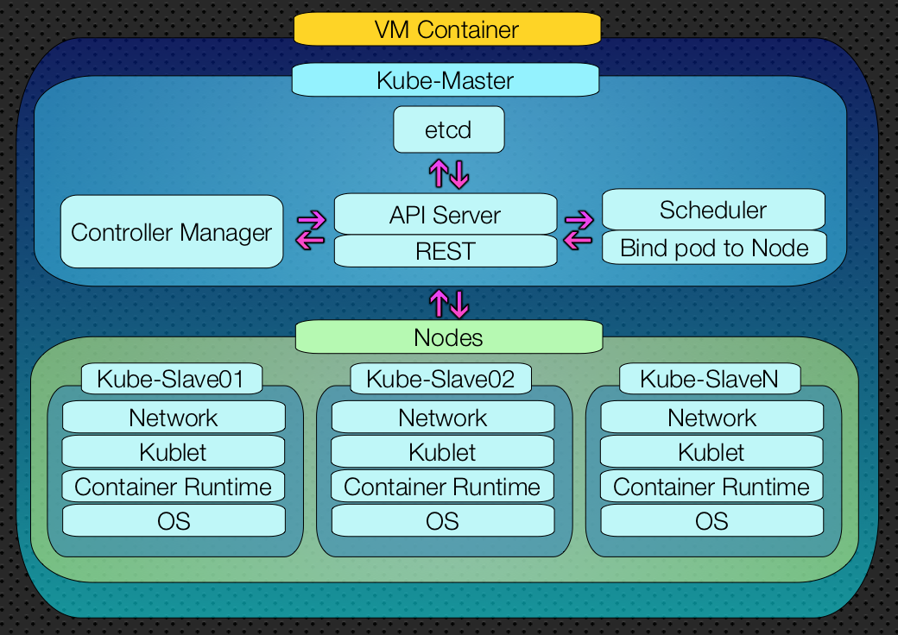

<div style="text-align:center">

</div>


# Costruisci il tuo Cluster Kubernetes Casalingo
#### Con versioni di Ubuntu dalla 18.04 alla 20.04

Kubernetes è una piattaforma open source, sviluppata attivamente dalla comunità in tutto il mondo. Permette la gestione e l'orchestrazione di container di applicazioni su larga scala, garantisce alle compagnie risparmio di risorse e la possibilità di effettuare rilasci in sicurezza ed affidabilità, in ogni genere di situazione.
Kubernetes permette a tutti gli sviluppatori DevOps di avere uno strumento efficace per sviluppare e deployare applicazioni in autonomia.

Perché servono abilità da DevOps?

Oggigiorno i DevOps sono molto richiesti dall'industria del IT. Varie aziende richiedono profili in grado di sviluppare e rilasciare in produzione gli applicativi.
Il salario medio di un DevOps engineer in Silicon Valley è circa  $140,000 all'anno, ovvero il 20% superiore del salario di uno sviluppatore, solo in italia si fa la fame ... e si continuando a sviluppare ancora applicazioni fortemente stateful e monolitiche.

Comunque possedere abilità DevOps oggi vuol dire essere molto competitivi sul mercato!

Per ulteriori informazioni vi prego di visitare il [sito ufficale](https://kubernetes.io/it/docs/concepts/overview/what-is-kubernetes/).


## Prerequisiti
- SO Linux / Windows / Mac
- [VMware](https://www.vmware.com/it.html) / [Oracle VM VirtualBox](https://www.virtualbox.org/) oppure un altro VM Container di vostro gradimento.
- - Installerò le VM su un server personale [PROXMOX](https://www.proxmox.com/en/)
- CPU Intel i5/i7/i9 oppure AMD Razen5/7
- RAM DISPONIBILE 12GB (Attenzione che non si potrà uttilizzare lo SWAP)
- HDD 150GB DISPONIBILI (Si consigia un SSD)
- [Download](https://releases.ubuntu.com/20.04.2/ubuntu-20.04.2-live-server-amd64.iso) di Ubuntu Server 20.04.2


## Server Personale
|  |  |
|:--------------|:-------------:|
| CPU   | i7 6°Gen 8 Core       |
| RAM   | 48Gb DDR4             |
| DISCO | SSD 512Gb + HDD 1Tb   |


<div>

</div>

#### Installare TRE VM:
-   VM Ubuntu Server (Configurazione minima per garatire un buon funzionamento)

| NOME | CPU | Ram (GB)| Disco (GB)|
|:--------------|:-------------:|--------------:|--------------:|
| Kube-Master  | 2 | 4 | 50 |
| Kube-Slave01 | 1 | 4 | 50 |
| Kube-Slave02 | 1 | 4 | 50 |

## Architettura
<div style="text-align:center">

</div>

#### Queste modifiche devono essere applicate a ogni server.
- Salire come root user
```
sudo -i
```

- Installare

```
apt-get update && apt-get install -y
apt-get -y install vim git curl apt-transport-https wget gnupg ntpdate mlocate
```

- Installare il servizio Docker.

```
apt-get install docker.io
```


- Abilitare il servizio Docker durante l'avvio.
```
systemctl enable docker.service
systemctl daemon-reload
systemctl restart docker
systemctl enable docker
```

#### Qui hai due possibilità:
#### - I SOLUZIONE
- La prima è quella di modificare il file di configurazione del servizio Docker
```
updatedb
locate docker.service
vi /etc/systemd/system/multi-user.target.wants/docker.service
```

Aggiungere la seguente configurazione alla fine dell'elemento denominato: EXECSTART

```
--exec-opt native.cgroupdriver=systemd
```
File finale dopo la configurazione

```
code ...//

Requires=docker.socket
[Service]
Type=notify
ExecStart=/usr/bin/dockerd -H fd:// --containerd=/run/containerd/containerd.sock --exec-opt native.cgroupdriver=systemd
ExecReload=/bin/kill -s HUP $MAINPID
TimeoutSec=0

//... code
```
#### - II SOLUZIONE
- La seconda soluzione non implica la modifica di unità systemd o drop-in.
- Creare (o modificare) il file di configurazione `etc/docker/daemon.json` e includere quanto segue:

```
{
	"exec-opts": ["native.cgroupdriver=systemd"],
	"log-driver": "json-file",
	"log-opts": {
		"max-size": "100m"
		},
	"storage-driver": "overlay2"
}
```

Dopo averlo salvato, riavvia il servizio Docker e verificare lo stato.
```
systemctl restart docker
systemctl status docker
```

Affinché kubelet funzioni correttamente, è essenziale disabilitare la memoria SWAP.
Lo spazio di paginazione del disco rigido viene utilizzato per memorizzare temporaneamente i dati quando non c'è abbastanza spazio nella RAM.
-Perciò disabilitare l'utilizzo della memoria Swap.
```
sed -i '/ swap / s/^\(.*\)$/#\1/g' /etc/fstab
swapoff -a

```

In alternativa si può modificare a mano:

```
vi /etc/fstab

/dev/disk/by-uuid/a24f00e7-918a-4a05-b4c9-35bdef750fb4 / ext4 defaults 0 0
#swap.img       none    swap    sw      0       0

```

Editare i file di host `vim /etc/hosts`

I vostri IP potrebbero essere diversi, dipende da come sono stati staccati dal DHCP.

- Sul server Kube-Master

```
127.0.0.1 localhost

127.0.0.1       kube-master
192.168.188.111 kube-slave01
192.168.188.112 kube-slave02
```

- Sul server Kube-Slave01

```
127.0.0.1 localhost

192.168.188.110 kube-master
127.0.0.1       kube-slave01
192.168.188.112 kube-slave02
```

- Sul server Kube-Slave02

```
127.0.0.1 localhost

192.168.188.110 kube-master
192.168.188.111 kube-slave01
127.0.0.1       kube-slave02
```

Creare un file per configurare le variabili di ambiente necessarie.`vi /etc/profile.d/kubernetes.sh`
```
#!/bin/bash
export KUBECONFIG=/etc/kubernetes/admin.conf
```
Riavviare la VM.
```
reboot
```

Scaricare e installare la chiave del repository Kubernetes.
```
curl -s https://packages.cloud.google.com/apt/doc/apt-key.gpg | apt-key add
```

Aggiungi il repository ufficiale Kubernetes.
```
apt-add-repository "deb http://apt.kubernetes.io/ kubernetes-xenial main"
```
Oppure puoi lanciare il seguente cmd:
```
echo "deb https://apt.kubernetes.io/ kubernetes-xenial main" | tee /etc/apt/sources.list.d/kubernetes.list"
```

Install Kubelet, Kubeadm, and Kubectl
- Kubelet: questo è un servizio di sistema che viene eseguito su tutti i nodi e configura i vari componenti del cluster.
- Kubeadm: questo strumento permette da riga di comando di installare e configurare i vari componenti del cluster.
- Kubectl: questo strumento permette da riga di comando di inviare comandi al cluster tramite l'API. Rende più facile lavorare con i comandi nel terminale.

```
apt update
apt -y install kubeadm kubectl kubelet
```

Impostiamo il kubelet in modalità standby perché si riavvia ogni secondo poiché è in un ciclo di standby e in attesa di ulteriori azioni.
```
apt-mark hold kubelet kubeadm kubectl
kubelet set on hold.
kubeadm set on hold.
kubectl set on hold.
```

Verifichiamo l'installazione
```
kubectl version --client && kubeadm version
```

#### Firewall

I moduli del kernel sono file di codice che possono essere caricati e rimossi dal kernel su richiesta.
Essi estendono le funzionalità del kernel senza bisogno di riavviare il sistema.
I moduli extra al kernel da caricare durante il boot sono configurati in una lista statica in `etc/modules-load.d/`

Configuriamo iptables per consentire il traffico attraverso il bridge di rete.
Questa modifica è vitale perché iptables (il firewall predefinito del server) dovrebbe sempre esaminare il traffico che passa sulle connessioni.
Ora caricheremo il modulo aggiuntivo br_netfilter.
```
modprobe overlay
modprobe br_netfilter
```

Oppure modificare il file di configurazione denominato `MODULES.CONF` e aggiungere quanto segue:

```
vi /etc/modules-load.d/modules.conf
overlay
br_netfilter
```

Creare un file di configurazione di sistema, nella configurazione sysctl da K8s, assegniamo il valore 1, che significa controllare il traffico.
```
vi /etc/sysctl.d/k8s.conf

net.bridge.bridge-nf-call-ip6tables = 1
net.bridge.bridge-nf-call-iptables = 1
net.ipv4.ip_forward = 1
```

Abilitare il file di configurazione del sistema.
```
sysctl --system
```

Crea il server master.
Il modulo del kernel br_netfilter è necessario per abilitare il traffico con bridge tra i pod Kubernetes nel cluster.
Consente ai membri del cluster di essere visualizzati e fruibili come se fossero direttamente collegati tra loro.
Per iniziare, dobbiamo assicurarci che il modulo br_netfilter venga caricato utilizzando il seguente comando:
```
lsmod | grep br_netfilter
```

#### START Kubket
```
systemctl enable kubelet
```

Scarica le config necessarie.
```
kubeadm config images pull
```


#### Crea cluster
Ora useremo i seguenti parametri per creare un cluster usando il comando kubeadm.

`--pod-network-cidr`
- Viene utilizzato per configurare la rete e impostare gli intervalli CIDR (Classless Inter-Domain Routing), che è un metodo di indirizzamento IP senza classi.
`--control-plane-endpoint`
- Questo è un set di endpoint di controllo comune per tutti i nodi se si utilizza in un cluster ad alta disponibilità.

Lanciare perciò:
```
kubeadm init --pod-network-cidr=10.0.0.0/16 --control-plane-endpoint=kube-master
```

Per iniziare a utilizzare il nostro cluster, dobbiamo consentire la configurarazione per il nostro utente cosi da esegurie eseguire kubectl.
```
mkdir -p $HOME/.kube
cp -i /etc/kubernetes/admin.conf $HOME/.kube/config
chown $(id -u):$(id -g) $HOME/.kube/config
```

Ora dovremmo essere in grado di distribuire una rete pod al cluster (esempio)
```
kubectl apply -f [podnetwork].yaml" con una delle opzioni elencate -> https://kubernetes.io/docs/concepts/cluster-administration/addons/
```

Ora possiamo connettere un numero qualsiasi di nodi al master copiando le chiavi dell'account di servizio su ciascun nodo e quindi eseguendo il comando seguente come root:
Worker 1 & Worker 2
```
kubeadm join kube-master:6443 --token bf6w4x.t6l461giuzqazuy2 \
--discovery-token-ca-cert-hash sha256:8d0b3...721 \
--control-plane
```

#### Verifica i nodi del cluster
Ora sul server Master, esegui il seguente comando per verificare se gli Worker 1 e 2 sono stati aggiunti al cluster.
```
kubectl get nodes
```

Possiamo anche aggiungere altri server master:
```
kubeadm join kube-master:6443 --token bf6w4x.t6l461giuzqazuy2 \
--discovery-token-ca-cert-hash sha256:8d0b3...b7d064e \
--control-plane
```

#### Verifichiamo lo stato del Cluster
```
kubectl cluster-info
```

#### Installa Calico
Ora installeremo e configureremo il plugin Calico.
Questo plug-in è un plug-in di rete basato su host per contenitori che le macchine virtuali utilizzano per motivi di sicurezza.
```
kubectl apply -f https://docs.projectcalico.org/manifests/calico.yaml
```

#### Verifichiamo lo stato dei Pod
```
watch kubectl get pods --all-namespaces
```

#### Verifichiamo la configurazione
```
kubectl get nodes -o wide
```


## Author
Andrei Alexandru Dabija

###### Un sincero grazie alla community mi ha permesso di Fornire questa guida
- [StackOverflow](https://stackoverflow.com/search?q=kubernates)
- [Techexpert](https://techexpert.tips/it/kubernetes-it/installazione-di-kubernetes-su-ubuntu-linux/)
- [liquidweb](https://www.liquidweb.com/kb/how-to-install-kubernetes-using-kubeadm-on-ubuntu-18/)
