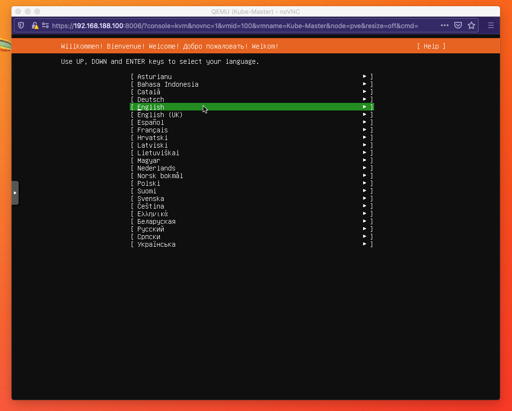
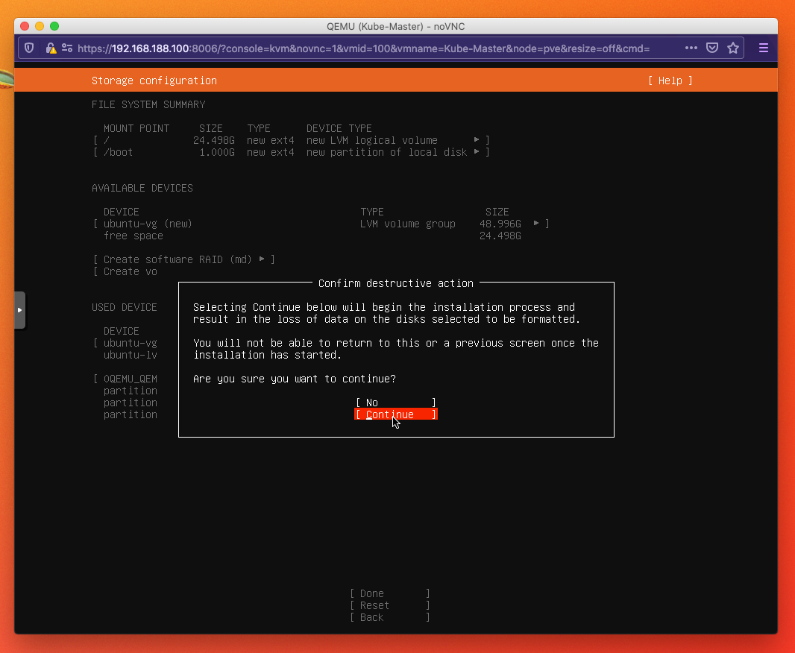
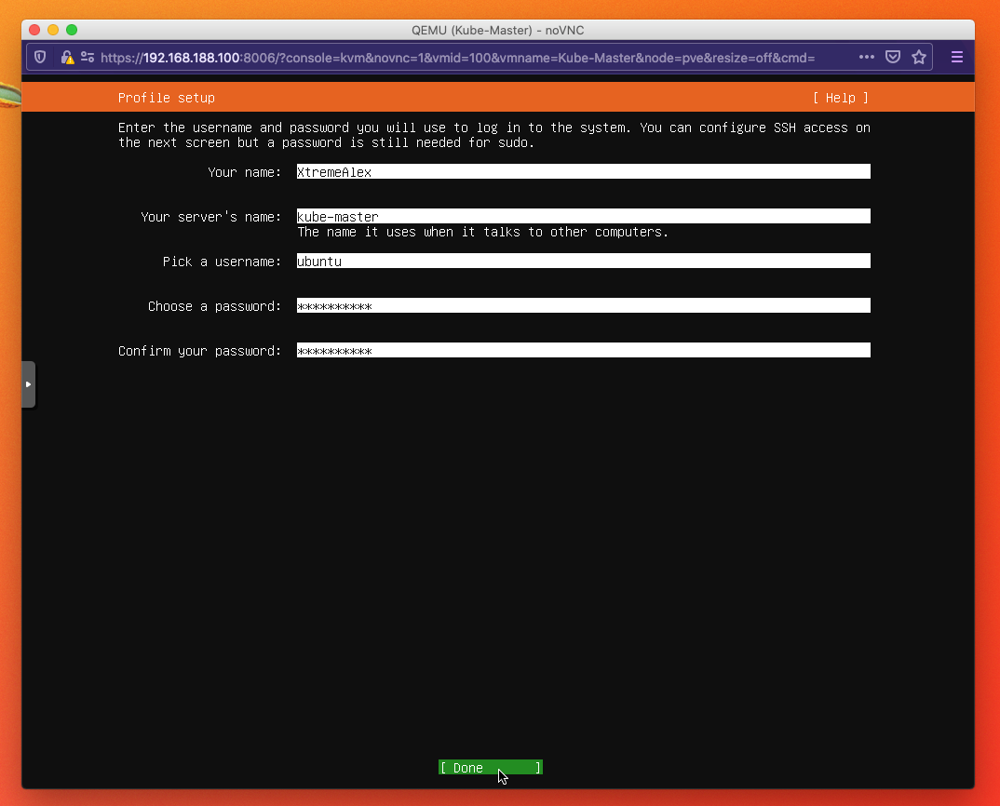
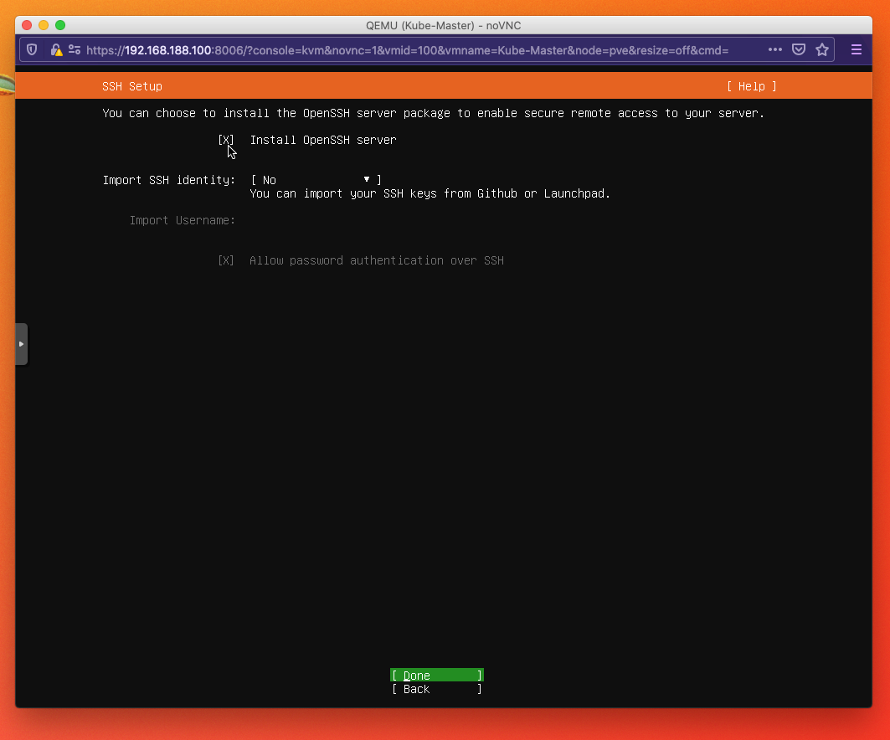
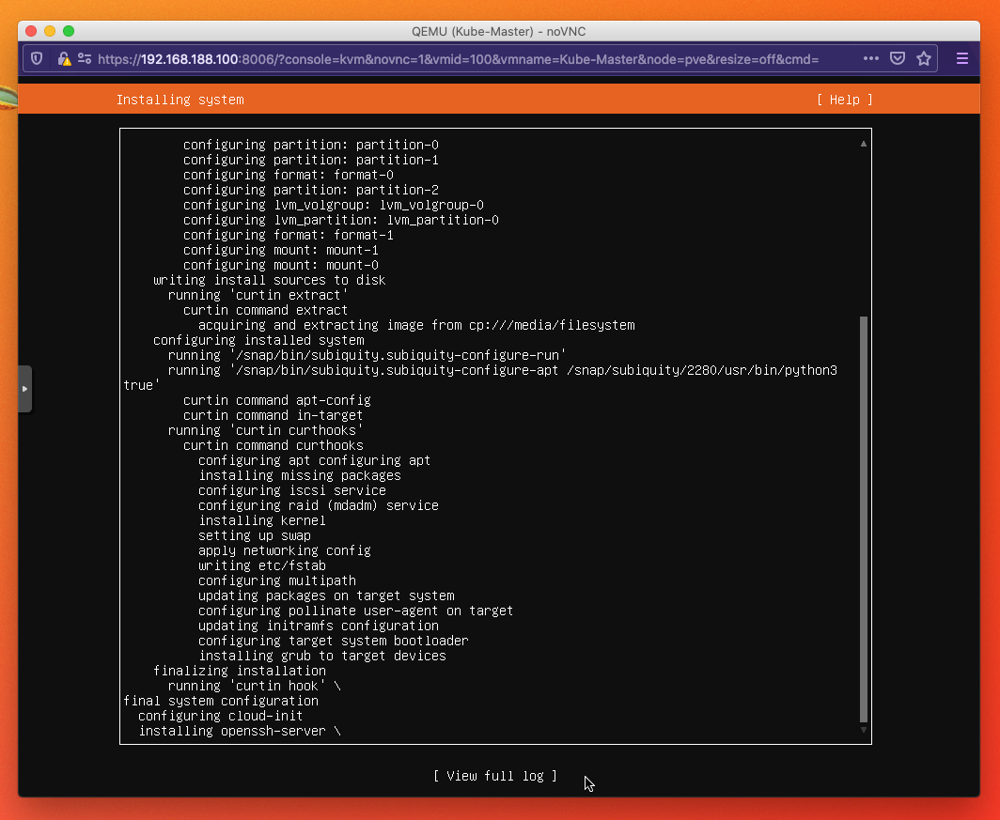

## Installazione Ubuntu Server

#### Prerequisiti
 - `ISO` Ubuntu Server Download [ubuntu-20.04.2-live-server-amd64.iso](https://releases.ubuntu.com/20.04.2/ubuntu-20.04.2-live-server-amd64.iso)

### Lasciare la Lingua Inglese

### Selezionare la Tastiera Italiana

### Premere `Done` finche non arriviamo qui e selezioniamo `Continue`

### Configurare il Server come in esempio

### Abilitare l'SSH
 - Proxmox ha una console interattiva per il momento abilitiamo l'ssh
 - In seguito potremmo disabilitarlo

### AutoInstall
 - In caso di necessità particolari potreste installare automaticamente alcuni tool
  - In questo esempio non selezionare nulla
 - Premere `Done`

### Attendere che l'installazione si concluda

## Author
`Andrei Alexandru Dabija`
