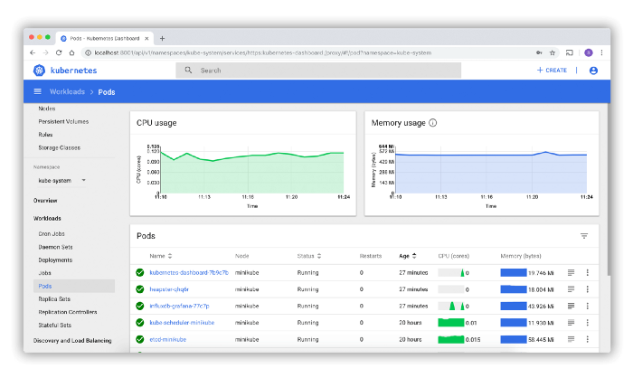

<div style="text-align:center">

</div>

# [Kubernetes Dashboard](https://github.com/kubernetes/dashboard)
## E' il client GUI più usato su Kubernetes.

Questa dashboard Web offre una panoramica delle applicazioni in esecuzione sul cluster, nonché permette la creazione o la modifica di singole risorse Kubernetes.

Rispetto ad altri client come Lens e Octant, la sua capacità di filtraggio è limitata.
Non puoi filtrare le risorse per label.

#### La sua configurazione non è così semplice.
Kubernetes Dashboard deve essere installata nel tuo cluster e bisogna gestire alcuni problemi di accesso dell'utente.

La sua configurazione predefinita richiede ogni volta l'accesso tramite il token oppure attraverso il caricamento del file KubeConfig.

Alcuni tutorial suggeriscono di iniettare un proxy di riserva OAuth2 davanti per semplificare il processo di accesso.

#### Per installarlo eseguire il seguente comando sul master
```
kubectl apply -f https://raw.githubusercontent.com/kubernetes/dashboard/v2.0.0-beta8/aio/deploy/recommended.yaml
```

#### Lanciare un Tunnel Proxy con:
```
kubectl proxy
```

#### Da browser
```
http://localhost:8001/api/v1/namespaces/kubernetes-dashboard/services/https:kubernetes-dashboard:/proxy/
```
