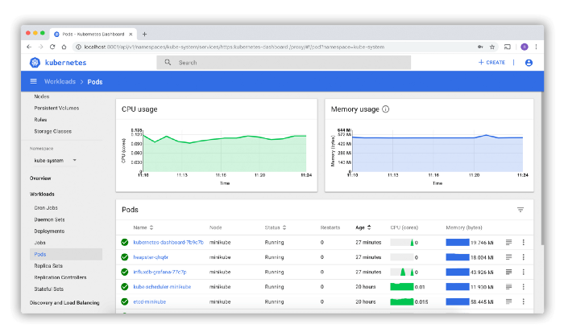

<div align="center">

</div>

# [Kubernetes Dashboard](https://github.com/kubernetes/dashboard)

È il client grafico più usato per Kubernetes: un'interfaccia web che mostra
cosa gira nel cluster e permette di creare o modificare le singole risorse.

Rispetto ad altri client come Lens e Octant filtra poco: per esempio non puoi
filtrare le risorse per label. E la configurazione non è immediata: la
dashboard va installata nel cluster e bisogna sistemare l'accesso degli utenti.
Di default chiede ogni volta un token o il caricamento del file kubeconfig;
alcuni tutorial suggeriscono di metterci davanti un OAuth2 proxy per
semplificare il login.

> Guida scritta nel 2021 per la dashboard v2.7.0. Nelle versioni più recenti
> l'installazione passa da Helm, e da Kubernetes 1.24 i ServiceAccount non
> ricevono più in automatico un Secret con il token: in quel caso il token si
> ottiene con `kubectl -n kube-system create token web-kube`.

Tutti i comandi si eseguono sul master con l'utente `kube` (quello creato nella
guida [`_install_k8s`](../_install_k8s/)).

## 1. Installa la dashboard

Come consiglia la pagina GitHub del progetto, prima elimina eventuali versioni
precedenti, poi fai il deploy:

```
su kube
kubectl delete ns kubernetes-dashboard
kubectl apply -f https://raw.githubusercontent.com/kubernetes/dashboard/v2.7.0/aio/deploy/recommended.yaml
kubectl get all --all-namespaces
```

## 2. Crea un utente amministratore

Per monitorare e controllare il cluster dalla dashboard serve un account con i
permessi giusti, altrimenti vedrai errori e warning. Crea il file YAML per il
ServiceAccount:

```
mkdir -p /kubernates/dashboard
vim /kubernates/dashboard/webkube-dashboard.yml
```

```
apiVersion: v1
kind: ServiceAccount
metadata:
  name: web-kube
  namespace: kube-system
```

```
kubectl apply -f /kubernates/dashboard/webkube-dashboard.yml
```

## 3. Dagli il ruolo di admin

Il file `ClusterRoleBinding.yml` collega il nuovo utente al ruolo
`cluster-admin`, che esiste già nel cluster:

```
vim /kubernates/dashboard/ClusterRoleBinding.yml
```

```
apiVersion: rbac.authorization.k8s.io/v1
kind: ClusterRoleBinding
metadata:
  name: web-kube
roleRef:
  apiGroup: rbac.authorization.k8s.io
  kind: ClusterRole
  name: cluster-admin
subjects:
- kind: ServiceAccount
  name: web-kube
  namespace: kube-system
```

```
kubectl apply -f /kubernates/dashboard/ClusterRoleBinding.yml
```

Nota: `cluster-admin` dà pieno controllo sul cluster. Va bene per un homelab;
altrove usa un ruolo più ristretto.

## 4. Recupera il token di accesso

Prima di aprire il browser ti serve il token segreto del nuovo utente:

```
kubectl -n kube-system describe secret $(kubectl -n kube-system get secret | grep web-kube | awk '{print $1}')
```

Tienilo da parte.

## 5. Apri un tunnel verso il master

Per raggiungere la dashboard da fuori il cluster, avvia il proxy sul master:

```
kubectl proxy
```

Poi, da una shell sul tuo PC, apri un tunnel SSH verso il master (metti l'IP
del nodo master al posto di `<IP_MASTER>`):

```
ssh -L 8001:127.0.0.1:8001 -N kube@<IP_MASTER>
```

## 6. Accedi

Apri nel browser:

```
http://localhost:8001/api/v1/namespaces/kubernetes-dashboard/services/https:kubernetes-dashboard:/proxy/
```

Scegli l'accesso con token e incolla quello dell'utente `web-kube`. Da qui hai
il pieno controllo di pod, servizi e deployment.

## Autore

Andrei Alexandru Dabija — [github.com/XtremeAlex](https://github.com/XtremeAlex)

Un grazie sincero alla community, senza la quale questa guida non ci sarebbe.
Per approfondire:

- [StackOverflow](https://stackoverflow.com/search?q=kubernates)
- [Techexpert](https://techexpert.tips/it/kubernetes-it/installazione-di-kubernetes-su-ubuntu-linux/)
- [Liquidweb](https://www.liquidweb.com/kb/how-to-install-kubernetes-using-kubeadm-on-ubuntu-18/)
- [Dgline](https://www.dgline.it/digitalroots/guida-per-la-costruzione-di-un-cluster-kubernetes-con-ubuntu/)
