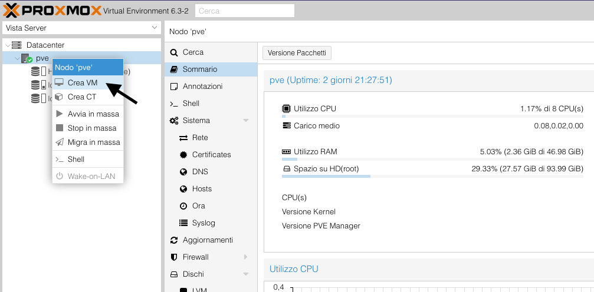
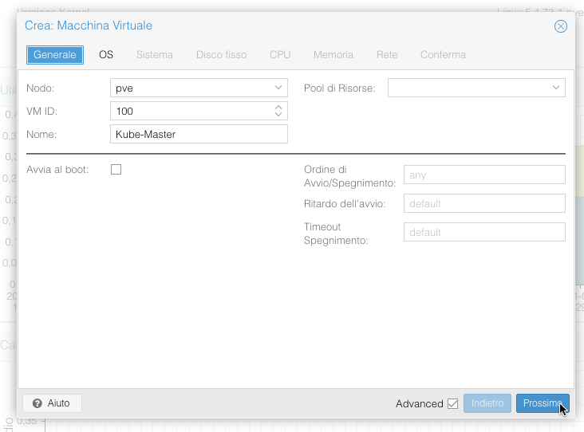
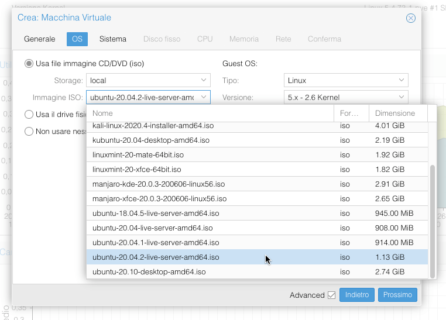
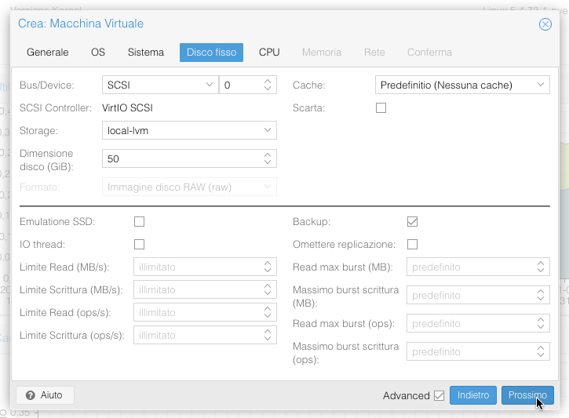
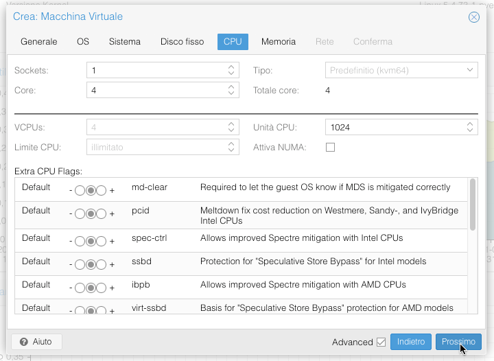
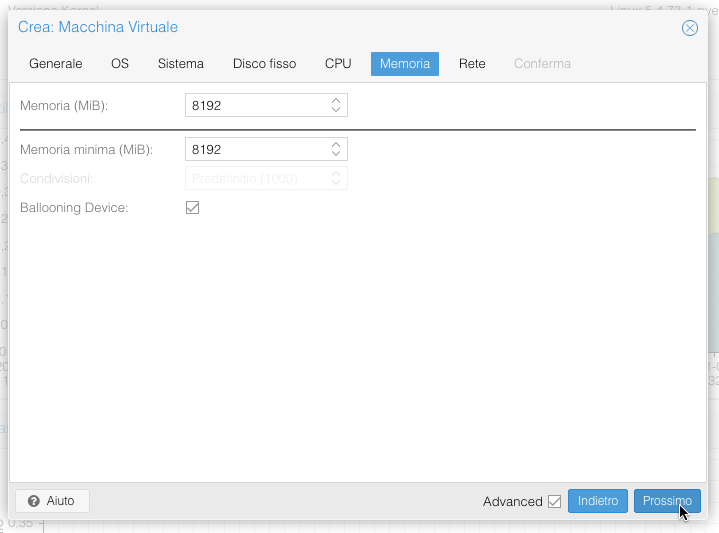
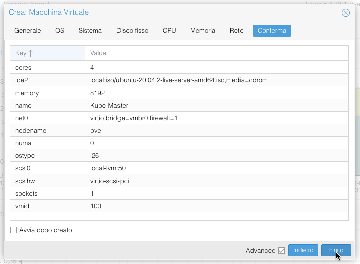
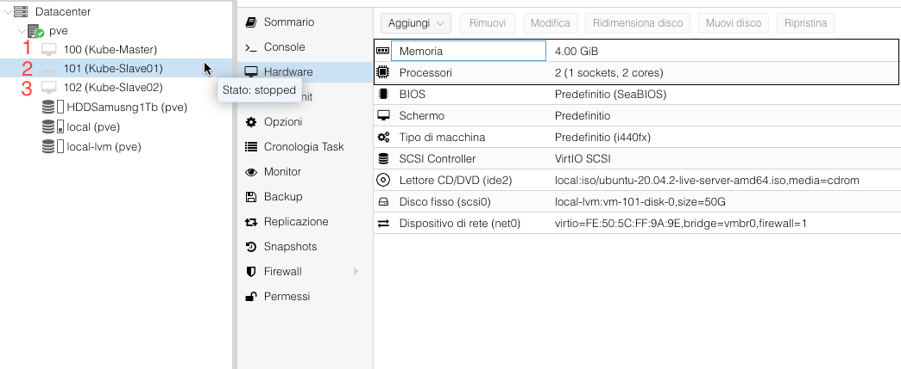

disponibili

# Costruisci il tuo Cluster Casalingo

## Prerequisiti
- SO Linux / Windows / Mac
- [PROXMOX](https://www.proxmox.com/en/)

#### Installare TRE VM:
-   VM Ubuntu Server (Configurazione minima per garatire un buon funzionamento)

| NOME | CPU | Ram (Mb)|  CPU Conf Consigliata | Ram (Mb) Conf Consigliata | Disco (GB)|
|:--------------|:-------------:|--------------:|--------------:|--------------:|--------------:|
| Kube-Master  | 2 | 4096 | 4 | 8192 | 50 |
| Kube-Slave01 | 1 | 2048 | 2 | 4096 | 50 |
| Kube-Slave02 | 1 | 2048 | 2 | 4096 | 50 |

### Crea una VM

### Configurazione di base

### Selezioniamo la ISO

### Selezioniamo il Disco, preferibilmente SSD

### Selezioniamo i core che vogliamo allocare alla vm

### Selezioniamo la ram che vogliamo allocare alla vm

### Confermare le configurazioni

### Clonare il kube-master
 - Rinominiamolo kube-slave01, kube-slave02 ecc...
 - Modificare core e ram ai cloni.

#### Visualizzare la guida su `_install_ubuntu/README.md` per la guida su come installare Ubuntu
 - #### [Clicca qui per installare Ubuntu Server](https://github.com/XtremeAlex/Kubernetes/tree/develop/_install_ubuntu)

## Author
`Andrei Alexandru Dabija`
