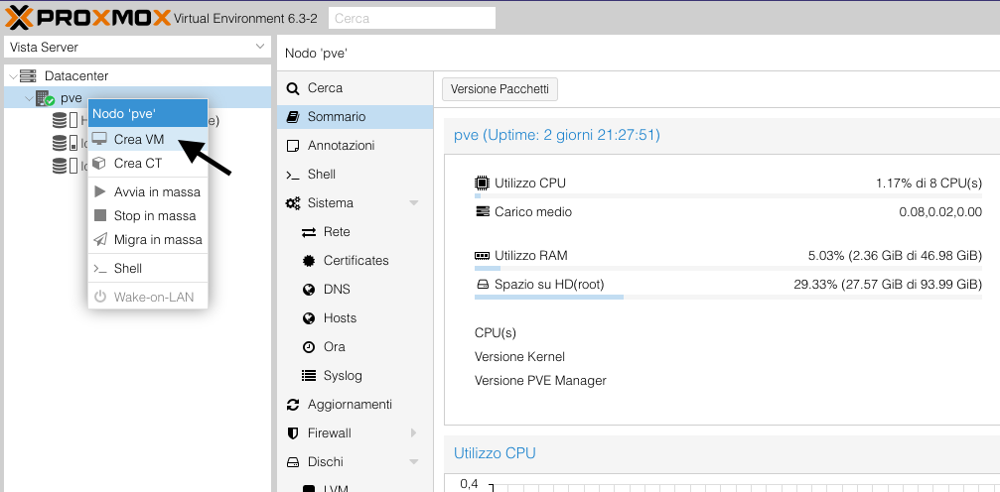
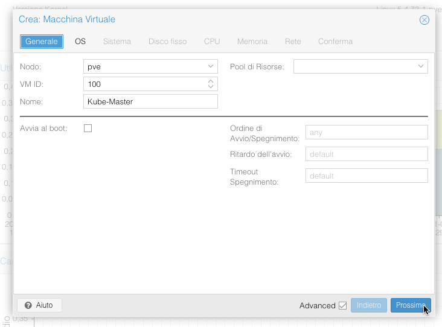
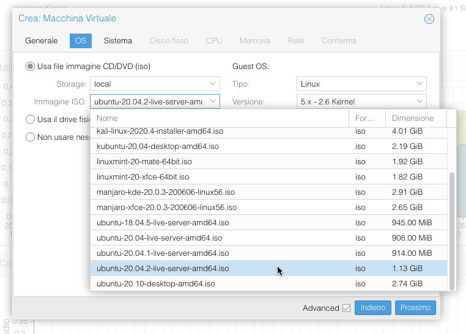
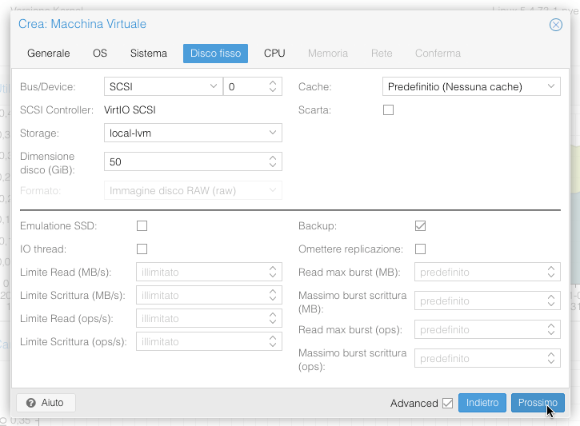
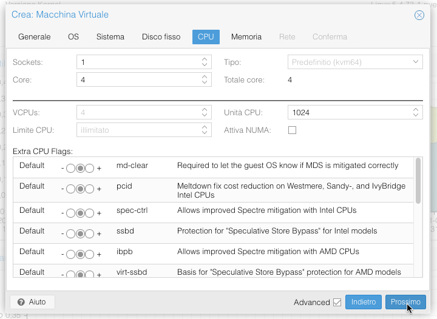
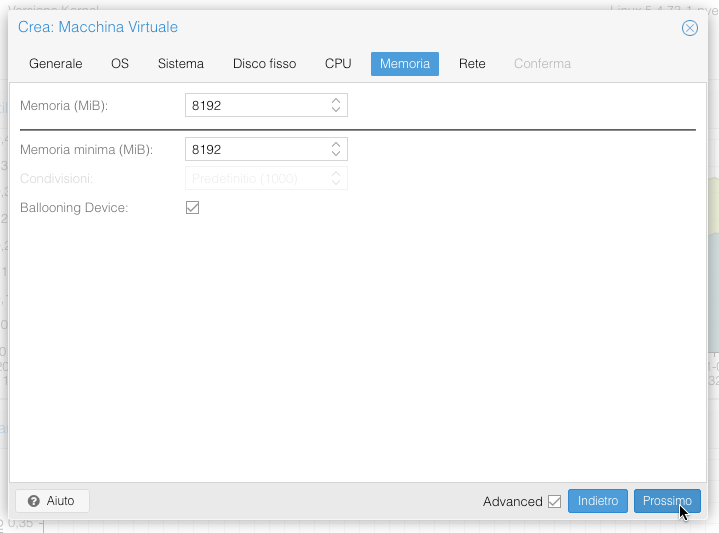
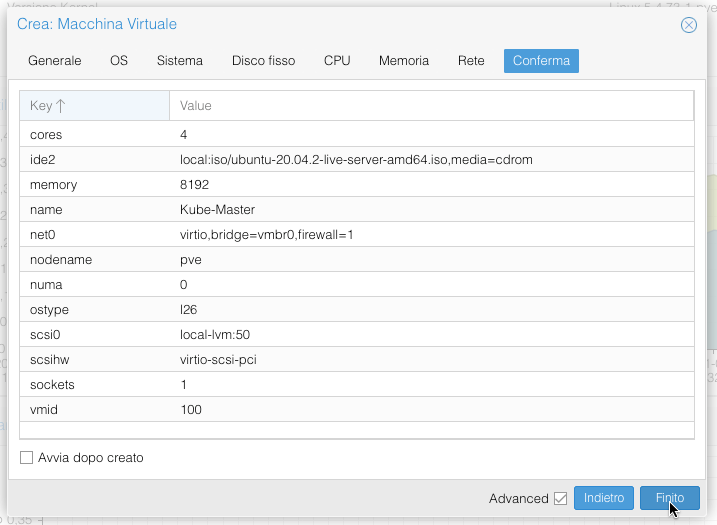
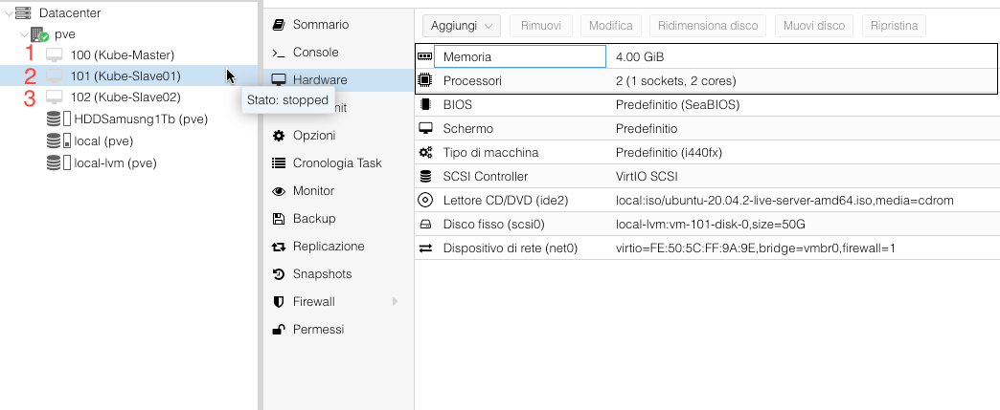

# Costruisci il tuo cluster casalingo: le VM su Proxmox

Il primo passo per il cluster Kubernetes è avere le macchine. Qui creiamo su
Proxmox le tre VM che faranno da master e da worker: se ne prepara una, poi la
si clona.

## Cosa ti serve

- Un computer con Linux, Windows o macOS da cui gestire Proxmox
- [Proxmox](https://www.proxmox.com/en/) già installato

## Le tre VM

Tutte con Ubuntu Server. La colonna "minimo" è il minimo per far girare le cose
bene; se hai risorse, usa quella consigliata.

| Nome | CPU (minimo) | RAM MB (minimo) | CPU (consigliata) | RAM MB (consigliata) | Disco (GB) |
|:--|:-:|--:|--:|--:|--:|
| Kube-Master  | 2 | 4096 | 4 | 8192 | 50 |
| Kube-Slave01 | 1 | 2048 | 2 | 4096 | 50 |
| Kube-Slave02 | 1 | 2048 | 2 | 4096 | 50 |

## 1. Crea una VM

## 2. Configurazione di base

## 3. Scegli la ISO

## 4. Scegli il disco, meglio se SSD

## 5. Scegli quanti core dare alla VM

## 6. Scegli quanta RAM dare alla VM

## 7. Conferma la configurazione

## 8. Clona il kube-master

- Chiama i cloni `kube-slave01`, `kube-slave02` e così via.
- Sui cloni abbassa core e RAM secondo la tabella qui sopra.

## Prossimo passo

Installa Ubuntu Server sulle VM seguendo la guida nel repository Linux
(`XtremeAlex/Linux/ubuntu/README.md`):
[installare Ubuntu Server](https://github.com/XtremeAlex/Linux/tree/main/ubuntu).

## Autore

Andrei Alexandru Dabija — [github.com/XtremeAlex](https://github.com/XtremeAlex)
